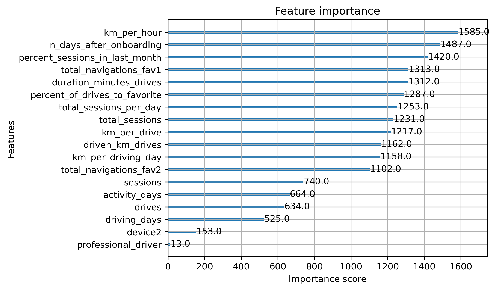
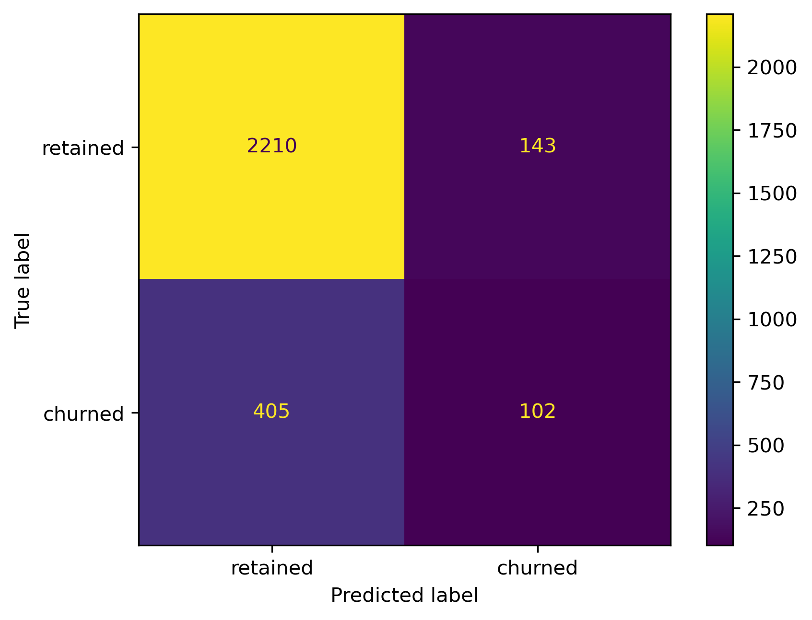

# 📊 Classification des donnees Waze

## 📝 Description du Projet
Ce projet vise à lutter contre l'attrition des utilisateurs (ou le churn) de l'application Waze en développant un modèle d'apprentissage automatique (machine learning) capable de prédire la probabilité de désengagement des utilisateurs. Grâce à l'analyse des données de comportement  des utilisateurs, ce projet fournit des perspectives stratégiques et des leviers d'action pour aider Waze à améliorer la rétention et à cibler efficacement les utilisateurs à haut risque de départ. Deux modèles basés sur les arbres sont utilisés : les forêts aléatoires (Random Forest) et XGBoost.
Le modèle XGBoost s'est révélé mieux ajusté aux données que le modèle de forêt aléatoire (random forest). Il est par ailleurs important de souligner que le score de rappel (17 %) est presque deux fois supérieur à celui obtenu avec le modèle de régression logistique précédent de l'étape 5, tout en conservant des scores d'exactitude et de précision similaires. l'exactitude du modèle XGBoost est 80%.

## Compréhension du monde des affaires
L'application de navigation gratuite Waze permet aux conducteurs du monde entier de se rendre plus facilement là où ils le souhaitent. Waze s'associe à des villes, des autorités de transport, des diffuseurs, des entreprises et des premiers intervenants pour aider le plus grand nombre à voyager plus efficacement et en toute sécurité.
L'équipe de données de Waze est sur le point de lancer projet visant à prévenir le désabonnement des utilisateurs de l'application Waze. Le taux d'attrition quantifie le nombre d'utilisateurs qui ont désinstallé l'application Waze ou qui ont cessé de l'utiliser. Le projet se concentre sur le taux de désabonnement mensuel.
Le développement d'un modèle de prédiction du taux de désabonnement permettra de prévenir le désabonnement, d'améliorer la fidélisation des utilisateurs et de développer l'activité de Waze. Un modèle précis peut également aider à identifier les facteurs spécifiques qui contribuent au désabonnement et répondre à des questions telles que qui sont les utilisateurs les plus susceptibles d'abandonner ? Pourquoi les utilisateurs se désistent-ils ? auand les utilisateurs se désabonnent-ils ?
Par exemple, si Waze peut identifier un segment d'utilisateurs qui présentent un risque élevé de désabonnement, Waze peut engager de manière proactive ces utilisateurs avec des offres spéciales pour essayer de les retenir. Dans le cas contraire, Waze risque de perdre ces utilisateurs sans savoir pourquoi.

## Compréhension des données
Ce jeu de données a été créé en partenariat avec Waze dans le cadre du projet de portfolio pour le certificat professionnel Google Advanced Data Analytics. La provenance du jeu de données d'origine remonte au certificat professionnel lui-même, disponible sur Coursera. Le jeu de données se compose d'un fichier .csv comprenant 15 000 observations et 13 variables distinctes. Les données incluent des informations relatives à l'activité des utilisateurs individuels de l'application Waze, telles que le nombre de sessions, de trajets, de kilomètres parcourus et d'autres variables d'activité, à la fois au global et sur un mois donné. Les données sont constituées de 13 variables : 8 variables de type entier (integer), 2 variables de type chaîne de caractères (string) et 3 variables de type flottant (float).

 ## Modélisation et évaluation de modèles
 Deux modèles ont été utilisé pour prédire le taux de désabonnement sur l'apli cation waze. Le modèle XGBoost est validé avec un score de rappel de 17% et d'éxactitude de 80%.
  Le graphique ci-dessous examine les caractéristiques les plus importantes de notre modèle final qui est bien-sur le modèle XGBoost.
 Dans le cadre de cette étape du projet, les ensembles de modèles basés sur des arbres de décision se sont avérés plus performants qu'un modèle de régression logistique isolé, car ils permettent d'atteindre des scores supérieurs sur l'ensemble des métriques d'évaluation tout en nécessitant un prétraitement des données moins complexe. Ils présentent toutefois l'inconvénient d'être moins interprétables quant à la logique de leurs prédictions.

 De plus, la matrice de confusion ci-dessous montre que sur les 2312 lignes dans les données de retenue de test, il n'y avait que 143 faux positifs et 405 faux négatifs.

 ## Conclusion
 
Ce modèle peut aider Waze à savoir si un abonné va se désabonner ou non.
Tout dépend de l'usage prévu pour ce modèle. S'il s'agit d'étayer des décisions stratégiques importantes, alors la réponse est non. Le modèle ne constitue pas un prédicteur suffisamment fiable, comme en témoigne son faible score de rappel (recall). En revanche, si le modèle est uniquement destiné à orienter de futures recherches exploratoires, il peut tout à fait présenter un intérêt.

Il serait utile de disposer d'informations au niveau de chaque trajet pour chaque utilisateur (telles que la durée des trajets, les localisations géographiques, etc.). Il serait également pertinent d'obtenir des données plus granulaires afin de mieux comprendre la manière dont les utilisateurs interagissent avec l'application. Par exemple, à quelle fréquence signalent-ils ou confirment-ils des alertes de dangers routiers ? Enfin, il pourrait être utile de connaître le nombre mensuel de lieux de départ et d'arrivée uniques renseignés par chaque conducteur.

